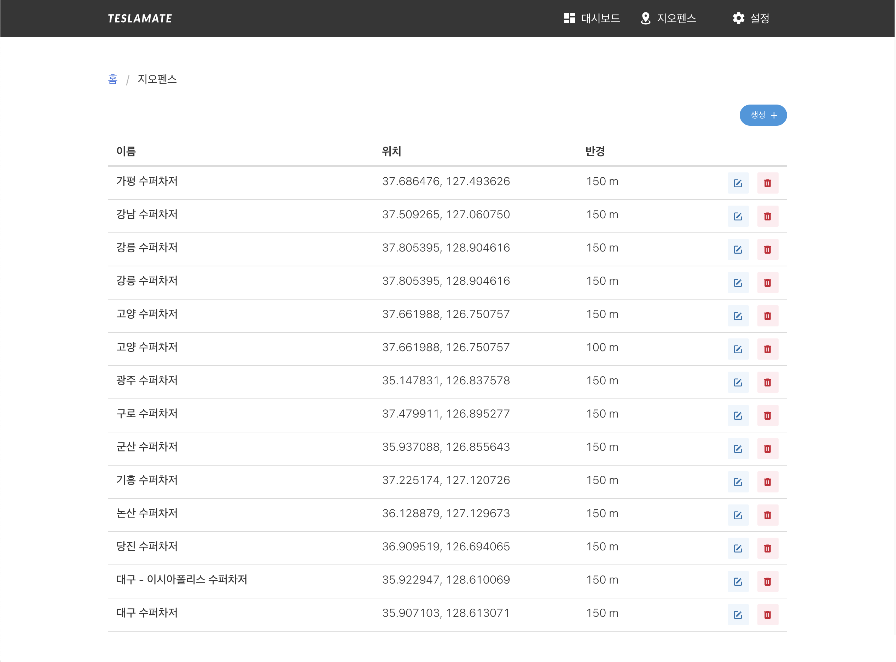

# 🚗 TeslaMate 대한민국 수퍼차저 Geofence ⚡️
</img>   
## 🗂 Index
  - [Overview](#overview) 
  - [Getting Started](#getting-started)
  - [Contributing](#contributing)
  - [Authors](#authors)
  - [License](#license)
<!--  Other options to write Readme
  - [Deployment](#deployment)
  - [Used or Referenced Projects](Used-or-Referenced-Projects)
-->
## 📜 About TeslaMate 대한민국 수퍼차저 Geofence
<!--Wirte one paragraph of project description -->  
테슬라메이트에 등록하기 위한 SQL문들을 공유하는 리포입니다.

대한민국 수퍼차저만 다루고 있습니다.

## 🖥 Overview
기본적으로 테슬라메이트에는 수퍼차저 geofence들이 등록되어 있지 않아

일일히 등록해줘야 하는데 편하기 하기 위해 SQL문을 통해서도 등록할 수 있습니다.

수퍼차저 위경도는 구글맵에서 테슬라 공홈 수퍼차지 지도에서 위치를 대조하여 직접 위경도를 추출했습니다.

따라서 **오차가 있을 수 있으므로 오차 발견 시, 이슈 부탁드려요.**

## 🏃Getting Started
**먼저 테슬라메이트가 필요합니다!**

### 🔨 Installing
<!-- A step by step series of examples that tell you how to get a development 
env running

Say what the step will be

    Give the example

And repeat

    until finished
-->
1. 다음 명령어로 Teslamate DB에 접속 `$ docker exec -it teslamate_database psql -U teslamate`
2. 데이터베이스 이름이 다를 시, 다음 명령어로 조회 `$ docker ps` ex) db 이름 pi_database_1 -> `$ docker exec -it pi_database_1 psql -U teslamate `
3. 리포지토리의 `supercharger_geofence.md` 파일 내용을 복사하여 명령어 실행

만약, 아래와 같은 에러 발생 시, 
```
ERROR:  numeric field overflow
DETAIL:  A field with precision 6, scale 4 must round to an absolute value less than 10^2.
```

아래 ALTER문을 실행해주세요
```
ALTER TABLE charging_processes ALTER COLUMN cost TYPE numeric(8,2);
ALTER TABLE geofences ALTER COLUMN cost_per_unit TYPE numeric(7,4);
```

5. 추가가 잘 되었는지 확인을 위해선, 다음 명령어 실행 `$ SELECT * FROM geofences;`
6. 삭제 하고 싶은 지오펜스가 있는 경우, 원하는 ID로 다음 명령어 실행 `$ DELETE FROM geofences WHERE id = XX;`
<!--
## Deployment
 Add additional notes about how to deploy this on a live system
 -->
 
 #### 🌏 추가된 Geofences
 </img>   
 
## 👫👫 Contributing
<!-- Write the way to contribute -->

## ✍️ Authors
  - [ahndwon](https://github.com/ahndwon)

See also the list of [contributors](https://github.com/ahndwon/readmeTemplate/contributors)
who participated in this project.
<!--
## Used or Referenced Projects
 - [referenced Project](project link) - **LICENSE** - little-bit introduce
-->

## 🔖 License

```
MIT License

Copyright (c) 2020 always0ne

Permission is hereby granted, free of charge, to any person obtaining a copy
of this software and associated documentation files (the "Software"), to deal
in the Software without restriction, including without limitation the rights
to use, copy, modify, merge, publish, distribute, sublicense, and/or sell
copies of the Software, and to permit persons to whom the Software is
furnished to do so, subject to the following conditions:

The above copyright notice and this permission notice shall be included in all
copies or substantial portions of the Software.

THE SOFTWARE IS PROVIDED "AS IS", WITHOUT WARRANTY OF ANY KIND, EXPRESS OR
IMPLIED, INCLUDING BUT NOT LIMITED TO THE WARRANTIES OF MERCHANTABILITY,
FITNESS FOR A PARTICULAR PURPOSE AND NONINFRINGEMENT. IN NO EVENT SHALL THE
AUTHORS OR COPYRIGHT HOLDERS BE LIABLE FOR ANY CLAIM, DAMAGES OR OTHER
LIABILITY, WHETHER IN AN ACTION OF CONTRACT, TORT OR OTHERWISE, ARISING FROM,
OUT OF OR IN CONNECTION WITH THE SOFTWARE OR THE USE OR OTHER DEALINGS IN THE
SOFTWARE.
```
